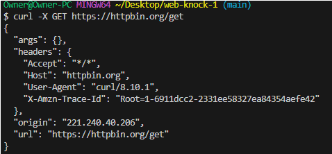
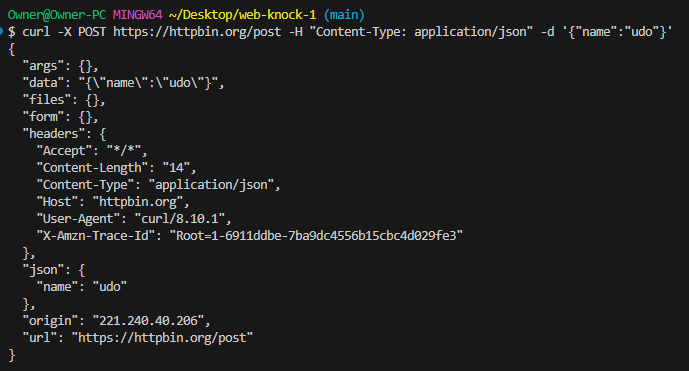
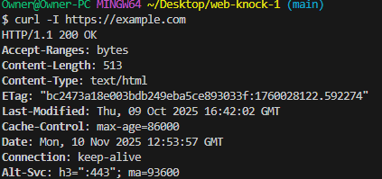
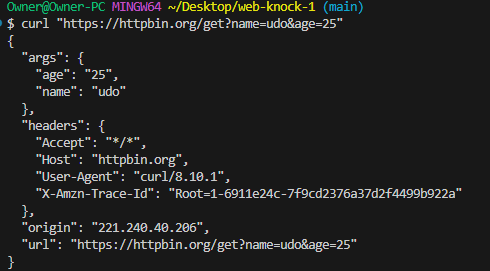
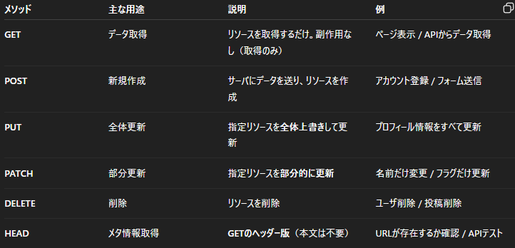

# 10. HTTPとは何か調べてまとめる
## HTTPの仕組み
WebブラウザとWebサーバ間でデータをやり取りする通信プロトコル 
クライアント:URLやメソッド（GET、POSTなど）を含むリクエストを送信 
サーバ:ステータスコードやコンテンツを含むレスポンスを返す。 
通信はステートレス(各リクエストが独立) 
Cookieやセッション、トークンなどを用いて状態管理を補完する。 
Webページ表示やAPI通信など、インターネット上の情報取得の基盤を担う。

## HTTPの特徴
１回のリクエストとレスポンスで完結  
拡張性が高く、ヘッダにより機能追加が容易で、Webブラウザやサーバ間で広く採用されている。  
また、TCP上で動作し信頼性の高い接続を行う。  
ユーザ状態はCookieやセッション管理に依存する。

## HTTP/1.1・HTTP/2・HTTP/3の概要
HTTP/1.1:従来方式で、同時並列処理に制約がある。  
HTTP/2:バイナリフレームと多重化→１つの接続で複数データを同時転送し、ヘッダ圧縮で高速化を実現する。
HTTP/3:UDPベースのQUIC→接続再確立なしの高速通信やモバイル環境での安定性

# 11. ブラウザのデベロッパーツールで通信を観察する
## Request Headers
content-type:
text/html
## Response Headers
user-agent:
Mozilla/5.0 (Windows NT 10.0; Win64; x64) AppleWebKit/537.36 (KHTML, like Gecko) Chrome/135.0.0.0 Safari/537.36

# 12. curlコマンドでGETリクエストを送る
-X = --request

# 13. curlコマンドでPOSTリクエストを送る
-H = --header  
-d = --data

# 14. HTTPステータスコードを調べてまとめる
200: OK（成功）  
301: Moved Permanently（恒久的に移動した）  
400: Bad Request（不正なリクエスト）  
404: Not Found（見つからない）  
500: Internal Server Error（サーバ内部エラー）  

1xx	情報（ほぼ使わない）  
2xx	成功  
3xx	リダイレクト  
4xx	クライアント側の問題  
5xx	サーバ側の問題  

# 15. 任意のWebサイトに対してHEADリクエストを送る
-I = --head

# 16. クエリパラメータ付きのリクエストを送る

# 17. HTTPメソッドの違いを調べる

# 18. レスポンスのContent-Typeを調べる
## HTML
$ curl -I https://httpbin.org
Content-Type: text/html; charset=utf-8
## JSON
$ curl -I https://httpbin.org/json
Content-Type: application/json
## 画像
$ curl -I https://httpbin.org/image/png
Content-Type: image/png

# 19. レスポンスヘッダーとボディの違いを整理する
## レスポンスヘッダー
サーバから返される通信情報  
ステータスコード、データ形式(Content-Type)、長さ(Content-Length)、キャッシュ設定など  
例: Content-Type: application/json
## ボディ
実際の中身（Webページ・JSONデータ・画像など）  
ブラウザやプログラムが実際に表示／利用するデータ  
例: <html>...</html>、{"result":"ok"}  